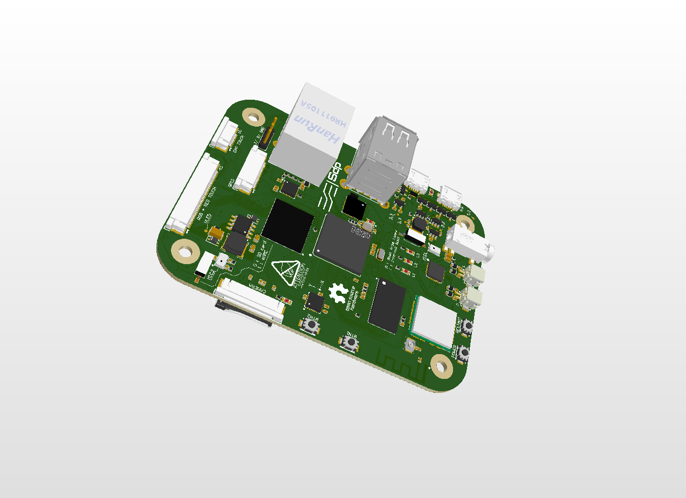
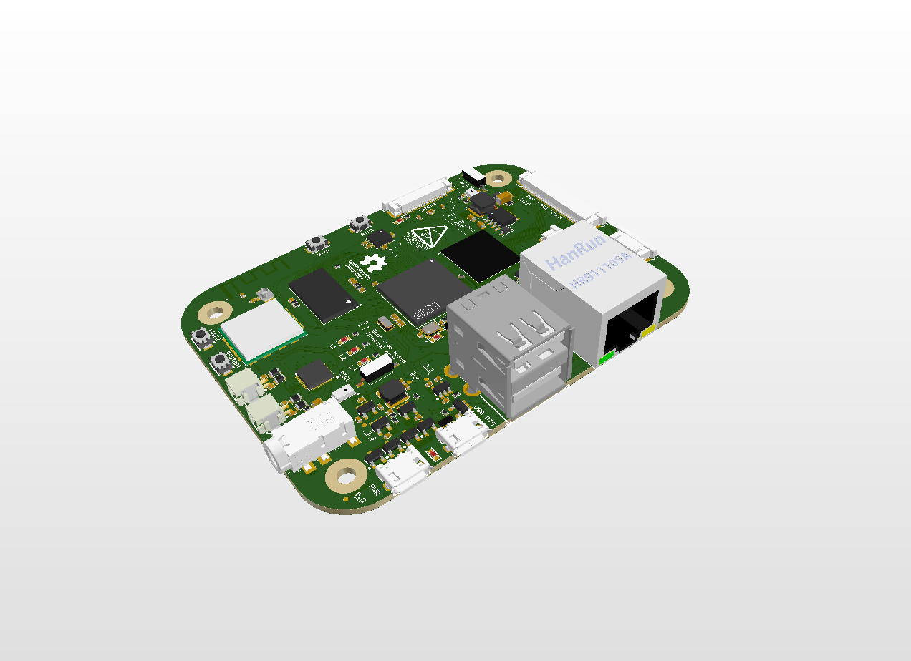
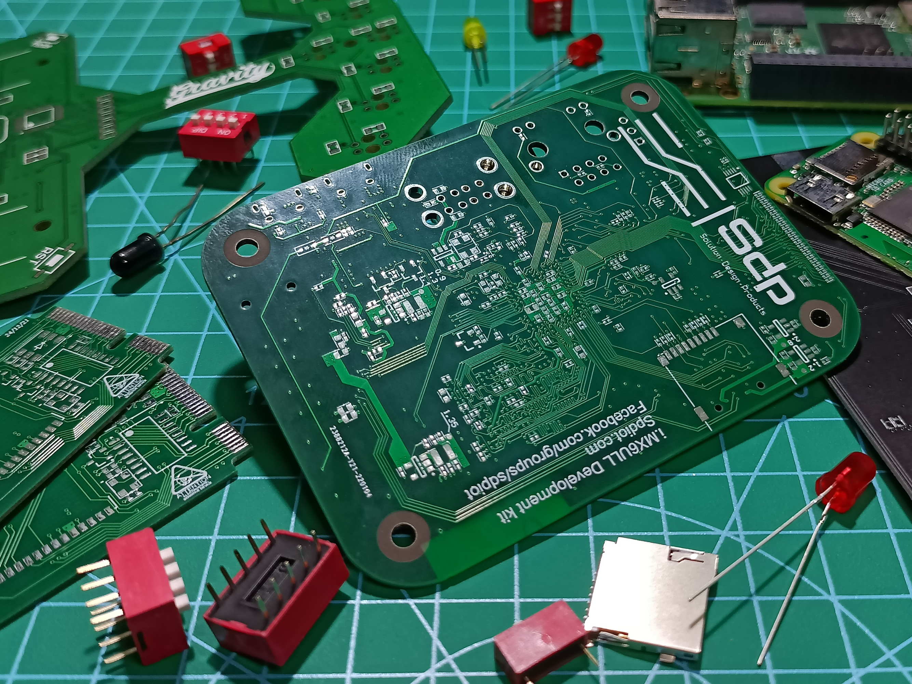

# iMX6ULL devkit
> This project is aiming to build the whole embedded board from scratch. From designing PCB to bring-up and program.
-  The board spec:
   -  CPU: NXP iMX6ULL
   -  RAM: 512MB
   -  2.4Ghz WiFi/Bluetooth chipset
   -  Audio CODEC
   -  eMMC storage
   -  24 bit LCD with touch support
   -  8 bit camera support
   -  6 axis sensor
   -  MicroSD card

## 1. **HARDWARE**

- The iMX6ULL is SoC with ARM 7 CPU.
- MPU6050 as 6-axis sensor, suitable for testing as well as a cool feature for applications.
- 4GB eMMC, you can store the OS on eMMC and boot it directly without an SD card.
- 24 bit general LCD, suitable for UI applications.
- 8 bit paralell camera.
- Audio CODEC with 2 microphones, 2 speaker output and a 3.5mm headphone jack.

#### The board has been designed and ready for fabricating.

#### Finish fabricating and here the result. Wait for assemble.

## 2. **LINUX**
   Updating...
## 3. **SOFTWARE**
   Updating...
